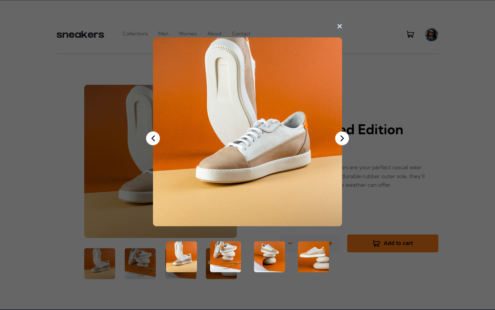
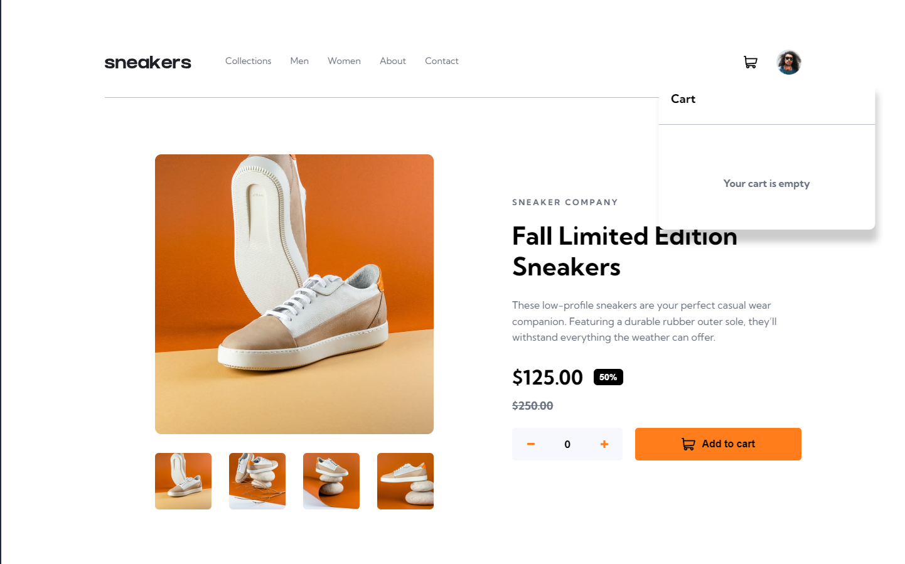
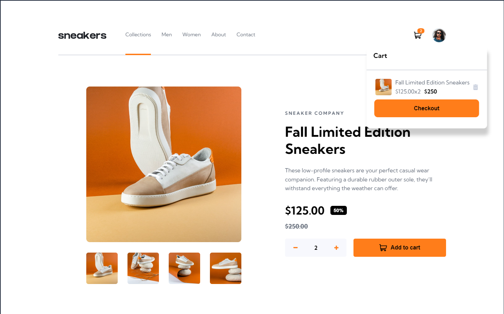
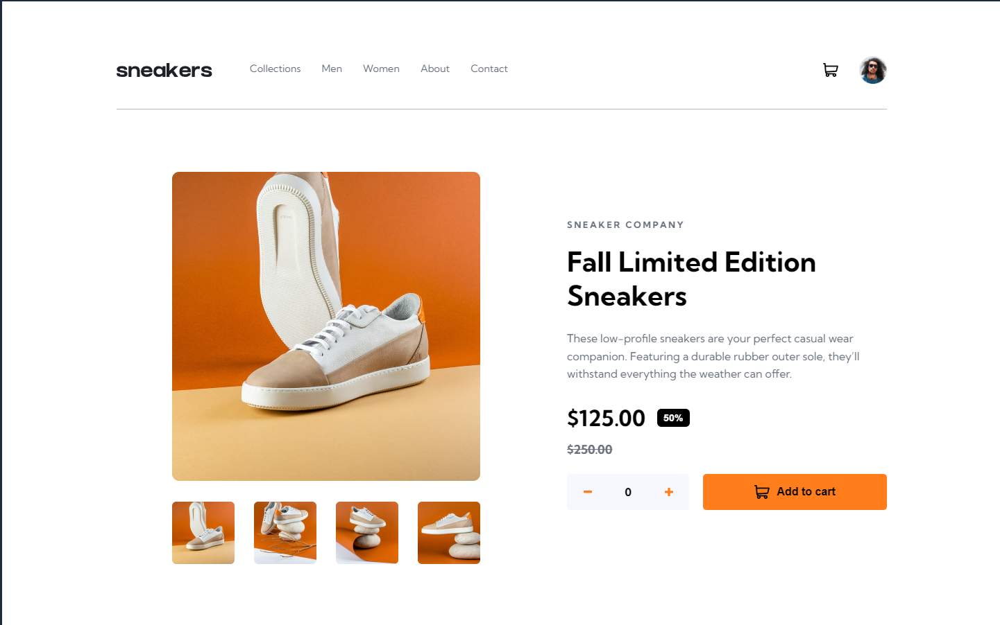
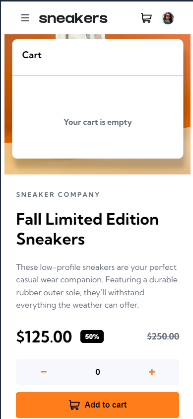
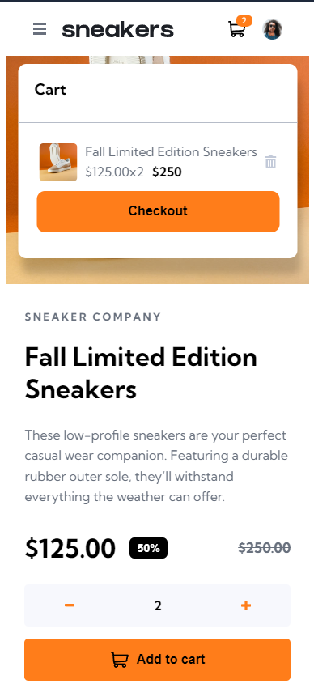
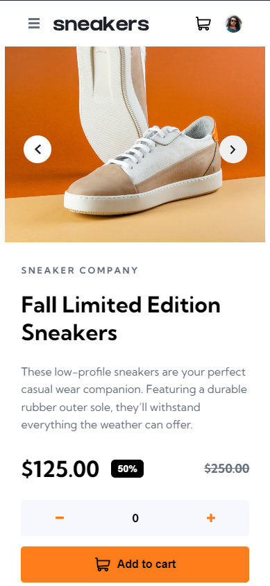
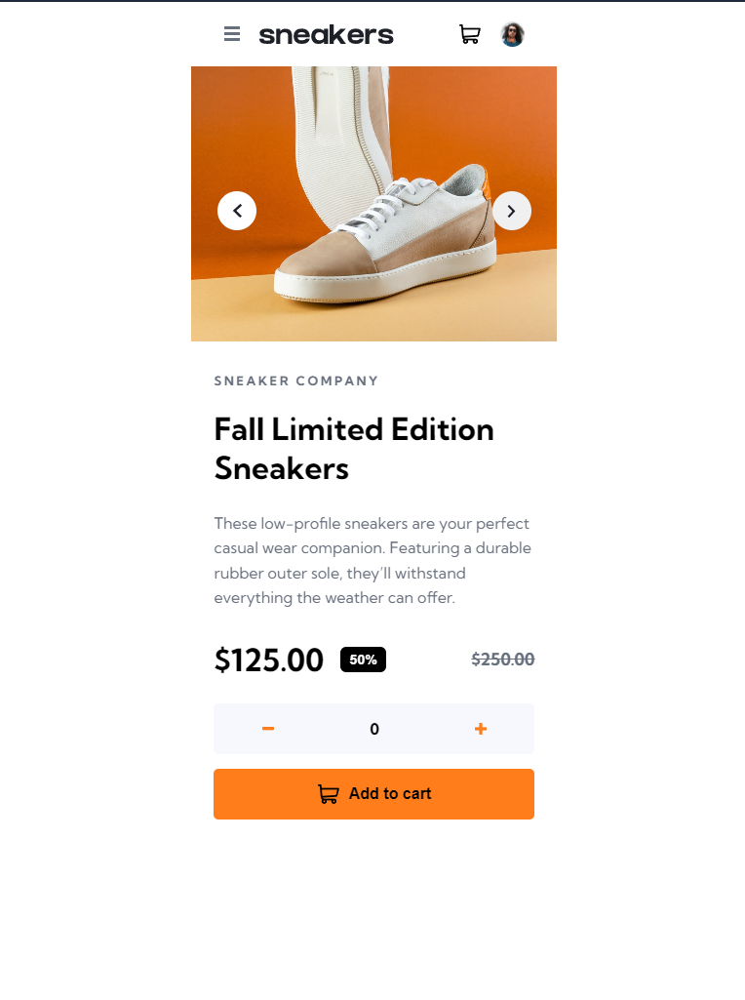

# Frontend Mentor - E-commerce product page solution

This is a solution to the [E-commerce product page challenge on Frontend Mentor](https://www.frontendmentor.io/challenges/ecommerce-product-page-UPsZ9MJp6). Frontend Mentor challenges help you improve your coding skills by building realistic projects.

## Table of contents

- [Overview](#overview)
  - [The challenge](#the-challenge)
  - [Screenshot](#screenshot)
  - [Links](#links)
- [My process](#my-process)
  - [Built with](#built-with)
  - [What I learned](#what-i-learned)
  - [Continued development](#continued-development)

## Overview

### The challenge

Users should be able to:

- View the optimal layout for the site depending on their device's screen size
- See hover states for all interactive elements on the page
- Open a lightbox gallery by clicking on the large product image
- Switch the large product image by clicking on the small thumbnail images
- Add items to the cart
- View the cart and remove items from it

### Screenshot










### Links

- Solution URL: [Add solution URL here](https://your-solution-url.com)
- Live Site URL: [Add live site URL here](https://your-live-site-url.com)

## My process

### Built with

- Semantic HTML5 markup
- CSS custom properties
- Flexbox
- Mobile-first workflow

### What I learned

I learned how work with modals(Open a lightbox gallery by clicking on the large product image).

To see how you can add code snippets, see below:

```html
<div class="overlay" id="overlayId"></div>
<div class="container-on">
  
  
  <div class="slide-over"></div>
  <div class="thumbs-over"></div>
</div>
<main>
  <header>
    <div class="menu-logo"></div>
    
    <nav></nav>
    <div class="cart-avatar">
      <div class="numberElements" id="numberElementsId"></div>
    </div>
  </header>
  <div class="section-article">
    <section>
      <div class="principal-image"></div>
      <div class="thumbs"></div>
    </section>
    <article>
      <span class="company">SNEAKER COMPANY</span>
      <h1>Fall Limited Edition Sneakers</h1>
      <p>
        These low-profile sneakers are your perfect casual wear companion.
        Featuring a durable rubber outer sole, they’ll withstand everything the
        weather can offer.
      </p>
      <div class="previous-price-discount">
        <div class="price-percentaje"></div>
        <span class="previous">$250.00</span>
      </div>
      <div class="quantity-cart-buttons">
        <div class="quantity-cart">
          
          <output class="quantity" id="quantityId">0</output>
          
        </div>
        <button class="cart" id="cartId">
          
          Add to cart
        </button>
      </div>
    </article>
  </div>
</main>
```

```css
@media (min-width: 75em) {
  .overlay {
    position: fixed;
    top: 0;
    left: 0;
    width: 100vw;
    height: 100vh;
    background: rgba(0, 0, 0, 0.6);
    z-index: 1000;
    visibility: hidden;
  }

  .container-on {
    display: block;
    position: fixed;
    top: 50%;
    left: 50%;
    transform: translate(-50%, -50%);
    z-index: 1100;
    visibility: hidden;
  }

  .close-over {
    position: absolute;
    right: 0;
    top: -40px;
    cursor: pointer;
    filter: grayscale(0) brightness(2);
  }

  .close-over:hover {
    filter: brightness(0) saturate(100%) invert(63%) sepia(98%) saturate(749%) hue-rotate(
        -7deg
      )
      brightness(104%) contrast(101%);
  }

  .img-over {
    /* visibility: hidden; */
    width: 550px;
    height: 550px;
    border-radius: 10px;
  }

  .thumbs-over {
    /* visibility: hidden; */
    display: flex;
    justify-content: space-evenly;
    padding-top: 40px;
  }

  .thumbs-over img {
    width: 90px;
    height: 90px;
    border-radius: 6px;
    cursor: pointer;
    background: var(--White);
  }
}
```

### Continued development

I have to improve the javascript code(use more functions to simplify the code) and the modal(lightbox gallery) has issues(the background of the thumbs is not white when hover over them)
